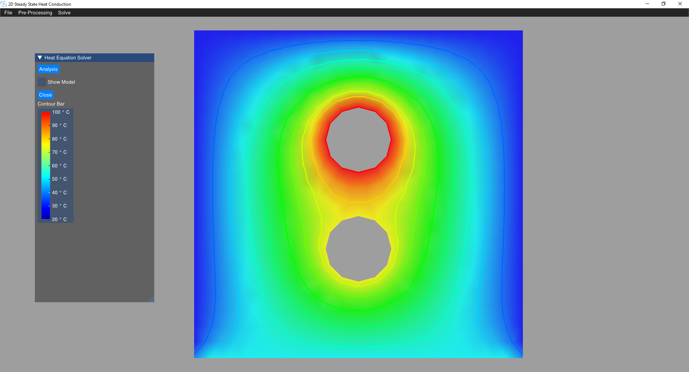
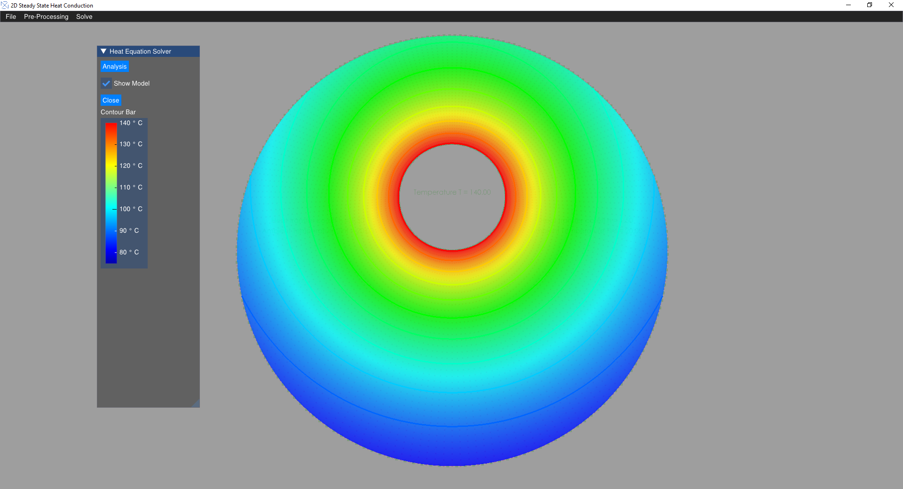

# 2D Heat Transfer Solver

Welcome to the 2D Heat Transfer Solver, a powerful tool for finite element analysis of steady-state 2D heat transfer problems. This software is designed to handle scenarios where temperature differences exist within a body or between a body and its surrounding medium. It proficiently solves conduction and convection problems, providing valuable insights into heat distribution.

## Features

- Solve steady-state 2D heat transfer problems.
- Conduction and convection problems are addressed.
- Utilizes the heat diffusion equation, a special case of the partial differential equation of the Helmholtz equation.

## User Interface

Take advantage of the following GUI functions to enhance your experience:

- **Pan**: Hold `Ctrl` and right-click drag.
- **Zoom In/Out**: Hold `Ctrl` and scroll.
- **Zoom Fit**: Press `Ctrl + F`.
- **Selection**: Hold `Shift` and left drag to select items.
- **Deselection**: Hold `Shift` and right drag to deselect items.

Additionally, OpenGL is incorporated for efficient and faster rendering.

## How to Use

1. Clone or download this repository.
2. Open the solution in your preferred C# development environment.
3. Build and run the application.

## Improved Version

This repository represents an updated C# version of the original 2D Heat Transfer Solver, available at the following link:

[Original Repository](https://github.com/Samson-Mano/2D_Heat_transfer)

For the latest enhancements, features, and bug fixes, please check out the updated version.

Thank you for using the 2D Heat Transfer Solver!

## Screenshots

